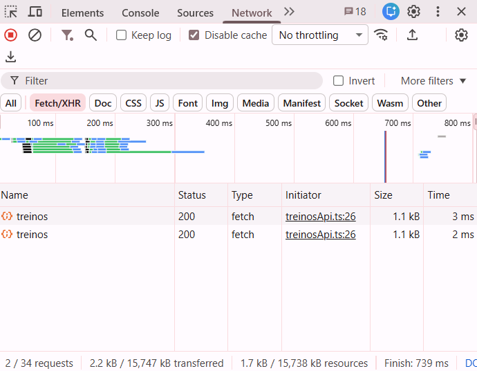
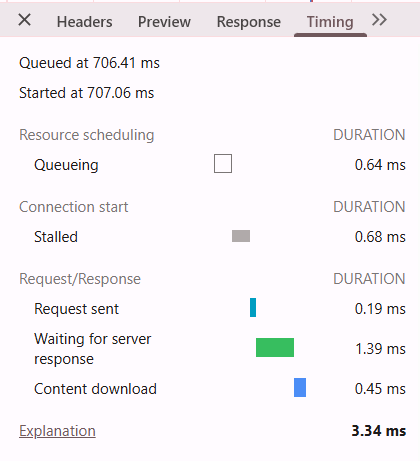
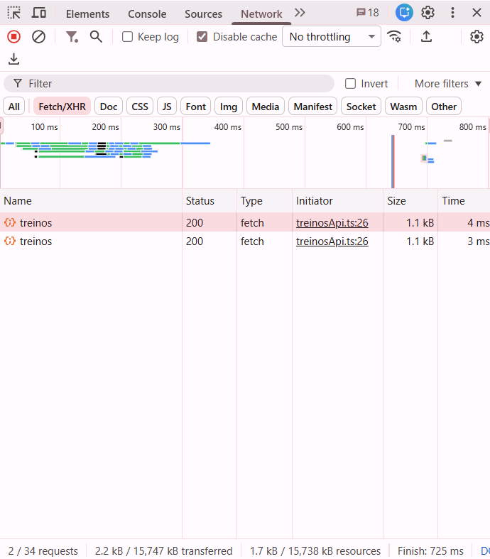
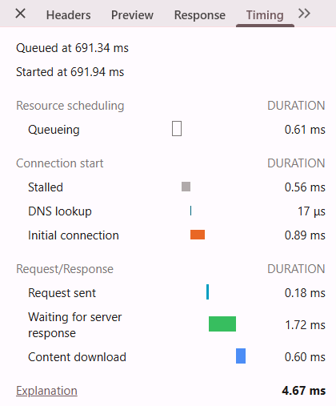

# Progressio — Sistema de gerenciamento de treinos e acompanhamento de evolução

**Integrante:** Thainara de Fátima Jacob Vieira  
**Disciplina:** Programação para Sistemas Web  
**Semestre:** 2026.2  
**Avaliação:** N1 — Projeto Evolutivo

## 1. Sobre o projeto

O **Progressio** é uma aplicação web desenvolvida para facilitar a organização de treinos de academia e o acompanhamento da evolução dos usuários ao longo do tempo. A proposta é permitir que cada pessoa organize diferentes fichas de treino, escolha exercícios, configure suas informações e registre sessões para comparar seu desempenho.

O sistema diferencia **exercícios de musculação**, acompanhados por séries, repetições e carga em quilogramas, de **exercícios de cardio**, acompanhados pelo tempo em minutos. Além de organizar fichas, apresenta histórico, indicadores e gráficos de progresso.

O catálogo de exercícios é consultado na API pública **wger Workout Manager**, que fornece informações como categoria, equipamentos, nomes e descrições. Quando existem traduções disponíveis, os dados são apresentados em **português e inglês**.

A aplicação utiliza **React, TypeScript e Vite** no frontend. Na versão da **N1**, foi incorporado um **backend próprio em Node.js e Fastify**, que permite listar, consultar, criar, alterar e excluir fichas de treino por meio de requisições HTTP. O CRUD funciona com **dados em memória**, sem banco de dados nesta etapa.

O Progressio possui identidade visual própria, com predominância de **azul-céu, branco e tons claros de cinza**, buscando uma interface simples, moderna e organizada.

## 2. Objetivo do projeto

O objetivo é tornar mais simples a criação de rotinas de treino e a visualização da evolução do usuário. Em vez de registrar as informações de maneira dispersa, o sistema reúne fichas, exercícios, sessões e indicadores em páginas conectadas.

- **Organizar fichas:** criar treinos diferentes, como Treino A, Treino B e Treino C.
- **Personalizar exercícios:** informar séries, repetições e cargas para musculação ou duração para cardio.
- **Registrar sessões:** associar exercícios realizados a uma data.
- **Acompanhar o progresso:** comparar cargas e tempos de sessões anteriores com registros recentes.
- **Integrar frontend e backend:** gerenciar as fichas por uma API própria, com CRUD HTTP funcional.

## 3. Principais funcionalidades

### Acesso e navegação

- Login de demonstração e logout.
- Controle do estado da autenticação pelo `localStorage` do navegador.
- Proteção de rotas internas.
- Menu de navegação entre as páginas.
- Página personalizada para endereços inexistentes (erro 404).

### Catálogo de exercícios

- Consulta à API pública wger.
- Busca pelo nome do exercício, considerando traduções em português e inglês quando disponíveis.
- Filtro por categoria.
- Cards com informações dos exercícios.
- Página de detalhes, com nomes, descrições, categoria e equipamentos quando fornecidos pela API.
- Diferenciação entre musculação e cardio.

### Fichas de treino

- Listar fichas cadastradas.
- Criar, selecionar, renomear e excluir fichas.
- Adicionar exercícios a uma ficha e removê-los.
- Editar séries, repetições, carga e tempo de cardio.
- Salvar alterações pela API própria Fastify.
- Visualizar quantidades de exercícios, total de séries e duração de cardio.
- Manter ao menos uma ficha no sistema, conforme a validação da API.

### Registro e evolução

- Registrar sessões de treino por data.
- Manter histórico dos exercícios registrados no navegador.
- Acompanhar evolução da carga em `kg` para musculação e do tempo em `min` para cardio.
- Consultar estatísticas e gráficos construídos com Recharts.
- Visualizar os dados resumidos no Dashboard.

### Experiência de uso

- Feedback visual de carregamento, sucesso, erro e listas vazias nos fluxos integrados.
- Interface responsiva, com reorganização de elementos para diferentes larguras de tela.

## 4. Tecnologias utilizadas

| Área | Tecnologia | Finalidade |
| --- | --- | --- |
| Frontend | React | Construção da interface em componentes |
| Tipagem | TypeScript | Definição de tipos e interfaces |
| Ferramenta de desenvolvimento | Vite | Execução, proxy da API externa e build |
| Navegação | React Router DOM | Controle das rotas da aplicação |
| Ícones | Lucide React | Ícones da interface |
| Gráficos | Recharts | Representação da evolução |
| Estilização | CSS | Layout e responsividade |
| Backend | Node.js + Fastify | API REST própria |
| CORS | `@fastify/cors` | Comunicação do navegador com a API |
| Requisições | `fetch`, `async/await`, HTTP e JSON | Comunicação assíncrona |
| Armazenamento | Memória do Fastify e `localStorage` | Fichas no servidor; login e histórico no navegador |
| Catálogo externo | wger Workout Manager | Dados e traduções de exercícios |

## 5. Organização com React

O React é responsável pela interface da aplicação. O projeto utiliza **componentes reutilizáveis**, permitindo separar elementos comuns das páginas e evitar repetição de código.

Os principais recursos empregados são:

- **Componentes e props:** reaproveitamento de elementos e envio de informações entre eles.
- **`useState`:** controle de fichas, campos de formulário, seleção de exercícios e mensagens na interface.
- **`useEffect`:** carregamento de dados em momentos específicos, como a abertura do Dashboard e da página de fichas.
- **Eventos:** ações de clique, edição de campos e envio de dados.
- **Renderização condicional:** exibição de conteúdo de acordo com o estado da interface.
- **`map`:** criação de listas visuais com base em arrays de fichas e exercícios.
- **`filter`:** aplicação de filtros e remoção de itens de listas.
- **Manipulação de arrays e objetos:** atualização das informações no estado da aplicação.

### Componentes reutilizáveis

- **`AppLayout`:** organiza as páginas internas, a navegação, o menu lateral e a barra superior.
- **`ProtectedRoute`:** restringe as páginas internas a quem concluiu o login simulado.
- **`StatCard`:** mostra estatísticas no Dashboard; recebe os valores e ícones por **props**.

## 6. TypeScript e organização dos tipos

O TypeScript adiciona tipagem ao projeto para ajudar na organização dos dados e na identificação de inconsistências durante o desenvolvimento.

As interfaces representam informações como:

- Exercícios do catálogo e suas traduções.
- Categorias e equipamentos.
- Fichas de treino e exercícios incluídos em cada ficha.
- Tipos de exercício (`musculacao` e `cardio`).
- Registros e histórico de progresso.
- Informações esperadas nas respostas das APIs.

Os tipos são organizados na pasta `src/types/`, incluindo os arquivos `Exercise.ts`, `Workout.ts` e `Progress.ts`.

## 7. Navegação e rotas protegidas

O **React Router DOM** controla a transição entre as páginas sem exigir o recarregamento completo da aplicação.

| Rota | Página | Função |
| --- | --- | --- |
| `/login` | Login | Entrada de demonstração |
| `/dashboard` | Dashboard | Indicadores e visão geral |
| `/exercicios` | Exercícios | Catálogo, busca e filtros |
| `/exercicios/:id` | Detalhes | Consultar e configurar um exercício |
| `/treinos` | Minhas fichas | Criar, editar, excluir e registrar treinos |
| `/progresso` | Progresso | Histórico e gráficos |
| Demais endereços | 404 | Informar rota inexistente |

As rotas internas são protegidas pelo componente `ProtectedRoute`. Quando um usuário não autenticado tenta acessá-las, ele é redirecionado ao login. A página 404 apresenta uma mensagem de página não encontrada e opções para retornar à navegação.

### Login de demonstração

```text
E-mail: usuario@progressio.com
Senha:  123456
```

O login é **mockado**: não existe um cadastro real de usuários, verificação por servidor ou emissão de JWT. O estado da autenticação é armazenado no `localStorage` do navegador e pode ser encerrado pelo logout.

## 8. Dashboard

O Dashboard é a visão geral da aplicação. Ele reúne indicadores para que o usuário encontre rapidamente informações importantes sobre seus treinos e sua evolução.

Entre os dados apresentados estão:

- Quantidade de fichas de treino.
- Quantidade de exercícios presentes nas fichas.
- Número de sessões registradas.
- Quantidade de exercícios com evolução positiva.
- Treino em destaque ou último treino registrado.
- Evoluções recentes.

Para os exercícios de musculação, o Dashboard mostra valores como séries, repetições e carga. Para cardio, apresenta o tempo em minutos. As fichas e exercícios são consultados da API própria **Fastify**; os indicadores de histórico e evolução utilizam os registros mantidos no navegador nesta etapa.

## 9. Catálogo de exercícios e API externa

O Progressio utiliza a API pública **wger Workout Manager** como fonte complementar de dados de exercícios.

O catálogo permite visualizar, pesquisar por nome e filtrar exercícios por categoria. A pesquisa considera os nomes nos idiomas disponíveis. Quando a API oferece os dados, os cards e a página de detalhes apresentam:

- Nome em português e inglês.
- Descrição em português e inglês.
- Categoria do exercício.
- Equipamentos utilizados.

O frontend consulta essa API por meio de `fetch`, `async/await` e `useEffect`. Durante o desenvolvimento, o **Vite** pode encaminhar as chamadas da wger usando o proxy configurado em `vite.config.ts`.

O acesso depende de conexão com a internet e da disponibilidade da API. Nem todos os exercícios possuem traduções completas, e a interface trata a ausência desses dados quando necessário.

## 10. Detalhes e configuração dos exercícios

Ao clicar em um item do catálogo, o usuário acessa sua página de detalhes para conferir as informações e selecionar a ficha em que deseja adicioná-lo.

### Exercícios de musculação

O usuário escolhe a ficha e configura:

- Quantidade de séries.
- Quantidade de repetições.
- Carga em quilogramas.

Exemplo ilustrativo:

```text
Exercício: Supino reto
Séries: 4
Repetições: 10
Carga: 30 kg
```

### Exercícios de cardio

O usuário seleciona a ficha e informa a duração em minutos. Para cardio, o formulário não exige séries, repetições ou carga.

Exemplo ilustrativo:

```text
Exercício: Cycling
Tempo: 30 min
```

Após a configuração, o exercício é incluído na ficha selecionada por uma requisição à API Fastify.

## 11. Fichas de treino

O usuário pode criar fichas diferentes, como **Treino A**, **Treino B** e **Treino C**. Cada uma contém sua própria lista de exercícios e configurações.

Na página **Minhas fichas**, o usuário pode selecionar uma ficha, alterar seu nome, excluir uma ficha permitida, remover exercícios e modificar os valores de séries, repetições, cargas ou tempo. Também são apresentados o total de exercícios, o total de séries de musculação e o tempo total de cardio.

A versão atual utiliza o **Fastify como fonte dos dados das fichas**, evitando depender apenas do armazenamento local para o CRUD principal.

## 12. Registro das sessões de treino

Depois de configurar uma ficha, o usuário pode registrar a realização do treino indicando uma data.

Nos exercícios de **musculação**, o registro contém informações como exercício, data, carga, séries, repetições, ficha e tipo. Nos exercícios de **cardio**, guarda exercício, data, duração, ficha e tipo.

Esses registros são utilizados posteriormente para mostrar o histórico e calcular a evolução. Nesta etapa, o histórico das sessões continua armazenado no **`localStorage`** do navegador.

## 13. Progresso e gráficos

A página **Progresso** permite selecionar um exercício e consultar seus registros, indicadores e gráficos ao longo do tempo. Os gráficos utilizam a biblioteca **Recharts**.

### Evolução na musculação

O sistema pode apresentar:

- Primeira carga registrada.
- Carga atual e maior carga.
- Diferença entre carga inicial e atual.
- Quantidade de registros.
- Séries e repetições.
- Histórico e gráfico em quilogramas.

Exemplo ilustrativo:

```text
Primeira carga: 20 kg
Carga atual: 30 kg
Maior carga: 30 kg
Evolução total: +10 kg
```

### Evolução no cardio

O sistema pode apresentar:

- Primeiro tempo registrado.
- Tempo atual e maior duração.
- Diferença entre o primeiro e o último registro.
- Quantidade de registros.
- Histórico e gráfico em minutos.

Exemplo ilustrativo:

```text
Primeiro tempo: 20 min
Tempo atual: 30 min
Maior tempo: 30 min
Evolução total: +10 min
```

## 14. API própria em Fastify — CRUD em memória

A entidade principal do backend é a **ficha de treino**. Um registro possui `id`, `nome`, `criadoEm` e uma lista de `exercicios`, que podem conter `id`, `nome`, `categoria`, `equipamento`, `tipo`, `series`, `repeticoes`, `carga` e `tempoMinutos`.

### Rotas disponíveis

| Método HTTP | Endpoint | O que faz | Status esperado |
| --- | --- | --- | --- |
| `GET` | `/health` | Confirma que o servidor está ativo | `200` |
| `GET` | `/treinos` | Lista todas as fichas | `200` |
| `GET` | `/treinos/:id` | Consulta uma ficha pelo ID | `200` ou `404` |
| `POST` | `/treinos` | Cadastra uma ficha | `201` ou `400` |
| `PUT` | `/treinos/:id` | Altera nome e exercícios | `200`, `400` ou `404` |
| `DELETE` | `/treinos/:id` | Exclui uma ficha | `204`, `400` ou `404` |

### Exemplo de cadastro

Corpo JSON de uma requisição `POST /treinos`:

```json
{
  "nome": "Treino B - Costas",
  "exercicios": []
}
```

O Fastify recebe os dados pelo `request.body` nas operações de criação e atualização. Nas rotas que trabalham com uma ficha específica, o identificador é recebido em `request.params.id`.

O backend realiza validações básicas e devolve respostas HTTP coerentes. Um cadastro bem-sucedido retorna **`201 Created`**, uma tentativa de consultar um recurso inexistente retorna **`404 Not Found`**, dados inválidos podem retornar **`400 Bad Request`** e uma exclusão realizada retorna **`204 No Content`**.

### Organização do backend

- `backend/src/server.ts`: inicia o Fastify, habilita o logger, configura CORS e define a rota `/health`.
- `backend/src/data/treinos.ts`: define os tipos e mantém o array de fichas em memória.
- `backend/src/routes/treinos.ts`: organiza as rotas GET, POST, PUT e DELETE.

**Não existe banco de dados nesta N1.** As fichas criadas ou modificadas ficam na memória do processo Fastify. Ao reiniciar o backend, as alterações são perdidas e os dados iniciais reaparecem. Essa característica está de acordo com os requisitos da avaliação.

## 15. Comunicação React → HTTP → Fastify

O fluxo de uma ação, como criar ou atualizar uma ficha, ocorre da seguinte forma:

1. O usuário clica em um botão ou preenche um formulário no React.
2. Um evento chama uma função assíncrona do serviço `src/services/treinosApi.ts`.
3. O serviço usa `fetch` e `async/await` para enviar uma requisição HTTP ao Fastify.
4. O servidor lê os dados, valida a requisição e consulta ou altera o array de fichas.
5. O backend retorna um status HTTP e, quando aplicável, uma resposta em **JSON**.
6. O frontend verifica `response.ok`, atualiza os estados com `useState` e apresenta sucesso ou erro.
7. O `useEffect` realiza consultas em páginas como Dashboard e Minhas fichas quando elas são carregadas.

Os estados de **loading**, erro e ausência de dados são tratados visualmente nos fluxos integrados. O método, URL, corpo (`body`), parâmetros (`params`), resposta e status podem ser observados pelo painel **Network** do navegador.

## 16. Armazenamento dos dados

A versão atual utiliza duas formas distintas de armazenamento:

| Informação | Armazenamento | Persistência |
| --- | --- | --- |
| Fichas e exercícios associados | Array em memória no Fastify | Mantidos durante a execução do backend |
| Estado do login simulado | `localStorage` | Mantido no navegador até sair ou limpar os dados |
| Sessões registradas e histórico de evolução | `localStorage` | Mantidos no navegador utilizado |
| Catálogo de exercícios | API pública wger | Consultado externamente |

Assim, o histórico de um navegador não aparece automaticamente em outro dispositivo. Também é possível que o histórico local continue existindo depois que o backend for reiniciado e suas fichas voltarem ao estado inicial.

O arquivo `workoutStorage.ts` continua responsável por funções ligadas aos registros locais. O CRUD das fichas na N1 utiliza `treinosApi.ts` e a API Fastify. Em versões futuras, a persistência em banco de dados poderá permitir armazenamento duradouro e sincronização entre dispositivos.

## 17. Estrutura principal do projeto

```text
progressio/
├── backend/
│   ├── src/
│   │   ├── data/
│   │   │   └── treinos.ts
│   │   ├── routes/
│   │   │   └── treinos.ts
│   │   └── server.ts
│   └── package.json
├── public/
├── src/
│   ├── components/
│   │   ├── AppLayout.tsx
│   │   ├── ProtectedRoute.tsx
│   │   └── StatCard.tsx
│   ├── data/
│   ├── pages/
│   │   ├── Login.tsx
│   │   ├── Dashboard.tsx
│   │   ├── Exercises.tsx
│   │   ├── ExerciseDetails.tsx
│   │   ├── Workouts.tsx
│   │   ├── Progress.tsx
│   │   └── NotFound.tsx
│   ├── services/
│   │   ├── authStorage.ts
│   │   ├── exerciseApi.ts
│   │   ├── treinosApi.ts
│   │   └── workoutStorage.ts
│   ├── types/
│   │   ├── Exercise.ts
│   │   ├── Workout.ts
│   │   └── Progress.ts
│   ├── App.tsx
│   ├── index.css
│   └── main.tsx
├── index.html
├── package.json
├── tsconfig.json
├── vite.config.ts
└── README.md
```

Essa estrutura separa responsabilidades: componentes compartilhados, páginas, serviços responsáveis pela comunicação, tipos TypeScript, dados e rotas do backend.

## 18. Fluxo principal do sistema

```text
Login de demonstração
         ↓
Dashboard
         ↓
Catálogo de exercícios
         ↓
Detalhes do exercício
         ↓
Selecionar uma ficha
         ↓
Configurar séries / carga / tempo
         ↓
Adicionar exercício pela API Fastify
         ↓
Minhas fichas — editar e salvar
         ↓
Registrar sessão por data
         ↓
Histórico e gráficos de progresso
```

## 19. Responsividade e identidade visual

O Progressio foi desenvolvido com **CSS, Grid, Flexbox e media queries** para reorganizar elementos conforme a largura da tela. Menus, cards, listas, formulários e gráficos são adaptados para uso em desktop e telas menores.

A interface usa predominantemente **azul-céu, branco e cinza-claro**, priorizando legibilidade e consistência visual. A responsividade pode ser demonstrada no Chrome DevTools com a ferramenta de visualização de dispositivos, testando uma largura de celular, como **375 px**, e uma largura de desktop.

### Acesso pela rede local

Para disponibilizar o Vite na rede local durante o desenvolvimento:

```bash
npm run dev -- --host 0.0.0.0
```

O terminal poderá mostrar um endereço semelhante a `http://192.168.x.x:5173/`. Para que **o CRUD funcione em outro dispositivo**, além do frontend, o endereço configurado para a API precisa apontar para o computador que executa o Fastify. `localhost:3333` no celular refere-se ao próprio celular.

## 20. Instalação e execução

### Pré-requisitos

- Node.js e npm instalados.
- Acesso à internet para consultar a API pública wger.
- Dois terminais, um para o backend e outro para o frontend.

Abra a pasta principal `progressio` no VS Code.

### Terminal 1 — Backend

No terminal aberto na raiz do projeto:

```bash
cd backend
npm install
npm run dev
```

A API deverá iniciar em **http://localhost:3333**. Para confirmar o funcionamento, consulte:

- `http://localhost:3333/health`
- `http://localhost:3333/treinos`

### Terminal 2 — Frontend

Abra um **segundo terminal na pasta principal `progressio`**, fora de `backend`:

```bash
npm install
npm run dev
```

Abra o endereço exibido pelo Vite, normalmente **http://localhost:5173**.

**Os dois servidores precisam estar rodando ao mesmo tempo.** A aplicação React se conecta ao Fastify em `http://localhost:3333`.

### Configuração de CORS

O Fastify usa `@fastify/cors`. Nesta versão local de desenvolvimento, foi usada a opção `origin: true` para permitir a comunicação durante os testes. Essa opção é permissiva e **deve ser substituída por origens autorizadas antes de publicar a API**.

## 21. Compilação e verificações

### Frontend

Na pasta principal do Progressio:

```bash
npm run build
```

Esse comando verifica os tipos e compila o frontend com Vite. No teste realizado para a N1, o comando terminou com sucesso. O Vite apresentou um **aviso** de bundle JavaScript maior que 500 kB, que não impede a compilação.

### Backend

Na pasta `backend`:

```bash
npx tsc --noEmit
```

O comando é utilizado para verificar o TypeScript sem gerar arquivos. O backend também deve permanecer executando normalmente pelo comando `npm run dev`.

## 22. Performance

A performance do Progressio ser foi avaliada pelo painel **Chrome DevTools → Network → Fetch/XHR → Timing**, observando requisições à API Fastify, como **GET `/treinos`**.

### Primeira medição

| Informação | Resultado |
| --- | --- |
| Requisição | **[GET /treinos]** |
| Status HTTP| **[200 OK]** |
| Iniciador | **[treinosApi.ts:26]** |
| Tempo total | **[3,34 ms]** |
| Tamanho da resposta | **[1,1 kb]** |

### Detalhamento da primeira medição
- Queueing: 0,64 ms
- Stalled: 0,68 ms
- Request sent: 0,19 ms
- Waiting for server response: 1,39 ms
- Content download: 0,45 ms





### Segunda medição

| Informação | Resultado |
| --- | --- |
| Requisição | **[GET /treinos]** |
| Status HTTP| **[200 OK]** |
| Iniciador | **[treinosApi.ts:26]** |
| Tempo total | **[4,67 ms]** |
| Tamanho da resposta | **[1,1 kb]** |

### Detalhamento da segunda medição
- Queueing: 0,61 ms
- Stalled: 0,56 ms
- DNS lookup: 17 µs
- Initial connection: 0,89 ms
- Request sent: 0,18 ms
- Waiting for server response: 1,72 ms
- Content download: 0,60 ms





### Análise técnica dos resultados 

Nas duas medições realizadas, a requisição GET /treinos apresentou tempos de resposta baixos, com 3,34 ms na primeira consulta e 4,67 ms na segunda. Em ambos os casos, a API retornou status 200 OK e resposta com aproximadamente 1,1 kB.
O maior tempo observado ocorreu na etapa Waiting for server response, com 1,39 ms na primeira medição e 1,72 ms na segunda, representando o tempo de processamento e resposta do servidor. Mesmo assim, os valores continuaram baixos e adequados para o cenário local testado.
Com base nesses resultados, não foi identificado gargalo relevante nessa operação. Por esse motivo, não foi necessária uma otimização específica para a rota GET /treinos nesta etapa. Em um cenário com maior volume de dados, seria importante repetir os testes e avaliar possíveis melhorias, como paginação ou redução da quantidade de dados retornados.
